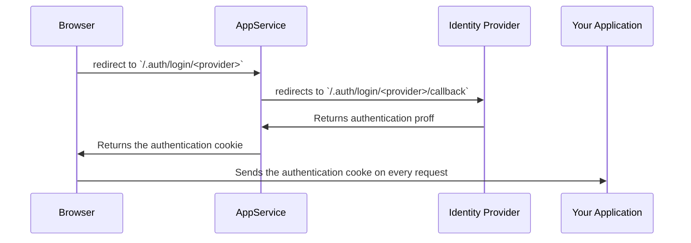
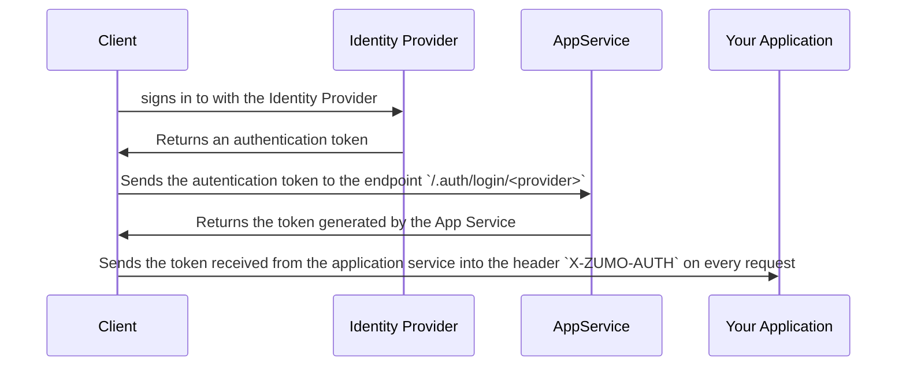

# Concepts:

-   Deployment Slots
-   Web App for Containers
-   Azure App Service Plan

# Azure App Service Plan

Defines the:

-   Operating System (Windows, Linux)
-   Region (West US, East US, etc.)
-   Number of VM instances
-   Size of VM instances (Small, Medium, Large)
-   Pricing tier (Free, Shared, Basic, Standard, Premium, PremiumV2, PremiumV3, Isolated, IsolatedV2)

of all the app services hosted on it.

### Hosting plans:

1. Shared compute: ( **Free and Shared**)

    - runs multitenant inside the same Azure VM, including apps of other customers
    - resources can't scale out
    - allocate CPU quotas to each app that runs on the shared resources

1. Dedicated compute: (**Basic, Standard, Premium, PremiumV2, and PremiumV3**)

    - dedicated Azure VMs
    - Shares VM resources with the other apps hosted in the app service plan
    - The higher the tier, the more VM instances are available to you for scale-out.

1. Isolated: (**Isolated and IsolatedV2**)
    - dedicated Azure VMs
    - dedicated Azure Virtual Networks
    - maximum scale-out capabilities

### Multitenancy

-   All apps run on all the VMs in the App Service Plan
-   All Deployment slots run on all VM instances of the App Service Plan
-   WebJobs and backups and diagnostic logs compete for the resources from the VMs of the App Service Plan

### Scalability

-   You can scale up an App service plan
-   You can scale out an app service plan by adding new VMs to the App Service Plan

## App Service on Linux

Limitations:

-   App Service on Linux **isn't supported on the Shared** pricing tier.
-   Disk latency for allocated volume in Azure storage for built-in images is higher than the container filesystem.

# CI & CD

-   Automated for: **Azure DevOps Services, GitHub, Bitbucket**
-   Manual Deployment: **Git Remote Repository, Azure CLI, ZIP deploy, FTP/S**

# Authentication & Authorization

## Authentication

Supported Identity providers:

1. [Microsoft Identity Platform](https://learn.microsoft.com/en-us/azure/app-service/configure-authentication-provider-aad)
    - endpoint: `/.auth/login/aad`
1. [Facebook](https://learn.microsoft.com/en-us/azure/app-service/configure-authentication-provider-facebook)
    - endpoint: `/.auth/login/facebook`
1. [Google](https://learn.microsoft.com/en-us/azure/app-service/configure-authentication-provider-google)
    - endpoint: `/.auth/login/google`
1. [Twitter](https://learn.microsoft.com/en-us/azure/app-service/configure-authentication-provider-twitter)
    - endpoint: `/.auth/login/twitter`
1. [Any OpenID Connect provider](https://learn.microsoft.com/en-us/azure/app-service/configure-authentication-provider-openid-connect)
    - endpoint: `/.auth/login/<providerName>`
1. [GitHub](https://learn.microsoft.com/en-us/azure/app-service/configure-authentication-provider-github)
    - endpoint: `/.auth/login/github`

### **Without provider SDK (Browser based apps)**

### **With provider SDK**

This is usually used by apps that do not have access to the browsers: Desktop, APIs, Azure Functions, etc

## Authorization

1. Allow unauthenticated requests

    The authorization will be handled by your application.

2. Require authentication

    All requests are authenticated. Not even the home page of your app is accessible.

## Token store

-   App Service provides a built-in token store
-   It becomes available when you enable authentication with any provider

## Logging and tracing

-   authentication and authorization traces are collected directly in your log files

# Networking

## Multitenant

-   For any of the plans: **Free, Shared, Basic, Standard, Premium, PremiumV2, and PremiumV3**
-   you can't connect the App Service network directly to your network.

### Inbound features

1. App-assigned address
1. Access restrictions
1. Service endpoints
1. Private endpoints

### Outbound features

1. Hybrid Connections
1. Gateway-required virtual network integration
1. Virtual network integration

## Isolated

You can run you app service into your own Azure virtual network.
